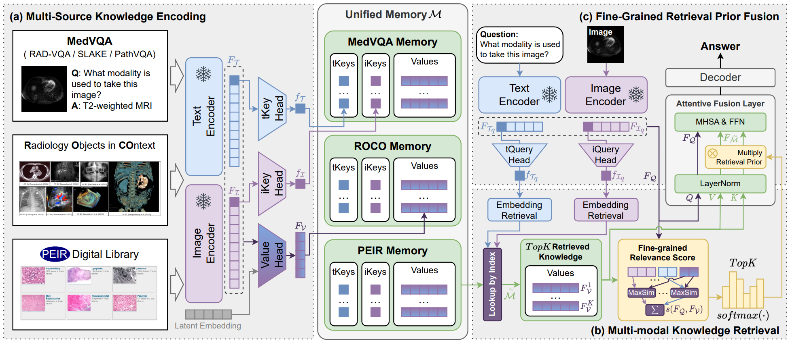

<div align="center">
  
# Re-rank Multi-Source Knowledge with Fine-Grained Relevance for Retrieval Augmented MedVQA
</div>

## 💡Overview
Fine-Grained Re-Ranking (FGRR) is an online retrieval-augmented framework for Medical Visual Question Answering, utilizing fine-grained encoding of multi-source knowledge and computing re-rank relevance scores between queries and knowledge. These scores serve as supervised priors, guiding the fusion of queries and knowledge and reducing interference from redundant information in answering questions.


## 📔PEIR Digital Library
The Pathology Education Informational Resource (PEIR) Digital Library, a public multidisciplinary image database for medical education, provided us with 30k image-text pairs, serving as an additional multi-modal knowledge base.
+ [PEIR](https://peir.path.uab.edu/library/)
## 🔨Setup

### Requirement
```
conda create -n fgrr python=3.8
conda activate fgrr
pip install -r requirements.txt
```

### 📑Data Preparation
We test our model on:
+ [VQA-RAD](https://osf.io/89kps/)
+ [SLAKE](https://www.med-vqa.com/slake/)
+ [PathVQA](https://github.com/UCSD-AI4H/PathVQA)

External knowledge bases beyond PEIR.
+ [ROCO](https://github.com/razorx89/roco-dataset)

### 📑Pre-extracted Feature and Annotations
Coming Soon.

| Dataset | Source  | Feature | Annotation |
| ---     | ---         | ---      | --- |
| VQA-RAD | . | . | . |
| SLAKE   | . | . | . |
| PathVQA | . | . | . |
| PEIR    | . | . | . |
| ROCO    | . | . | . |

### 🔨Pre-trained weights
Coming Soon.

### 🔨Training
Note: The first time you run this, it will take time to load knowledge features from `./Annotations/memory/memo_list.json` into the temporary folder `./temp/`. Please be patient.
```
 bash trainval_pathvqa.sh
```


## 📝Acknowledgements
We also reference the excellent repos of [BioMedCLIP](https://huggingface.co/microsoft/BiomedCLIP-PubMedBERT_256-vit_base_patch16_224) in addition to other specific repos to the baselines we examined (see paper).

## 📝Citation
If you find this paper useful, please consider staring 🌟 this repo and citing 📑 our paper:
```

```
